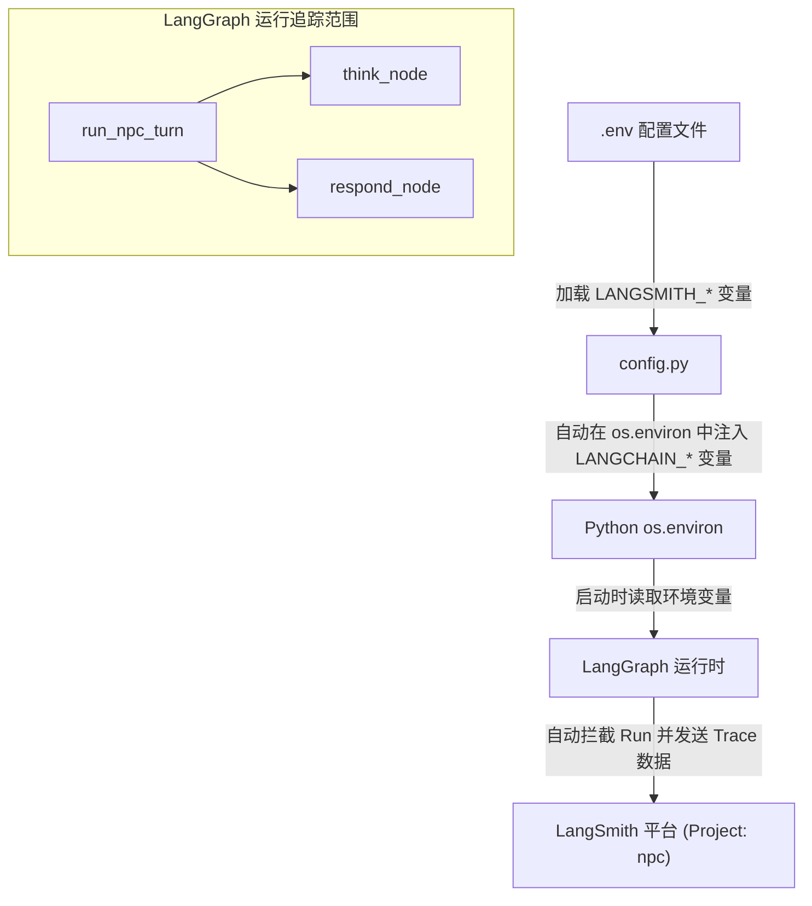

# LangSmith 追踪功能设计方案

## 1. 概述
本项目是一款基于 LangGraph 构建的“NPC 机器人反向图灵测试”命令行游戏。为了更好地监控 NPC 的决策过程（内心独白节点 `think` 和对外回复节点 `respond`）、调试 Prompt 效果以及追踪 LLM 的 Token 消耗与响应耗时，本项目计划引入 LangSmith 追踪功能。
通过在环境配置中无侵入地映射环境变量，让 LangGraph 原生的追踪机制自动生效，实现零业务代码侵入的全局可观测性。

## 2. 架构设计与实现原理
LangChain/LangGraph 生态系统原生支持通过特定的环境变量自动开启 LangSmith 追踪。为了兼容用户提供的自定义环境变量前缀（`LANGSMITH_`），我们将在系统初始化（配置加载阶段）自动将这些变量映射为 LangChain 官方标准的环境变量。

### 2.1 环境变量映射关系
当系统启动并加载 `config.py` 时，将执行以下映射逻辑：

| 用户配置的环境变量 (`.env`) | 自动映射 of 官方标准环境变量 | 作用说明 |
| :--- | :--- | :--- |
| `LANGSMITH_TRACING` | `LANGCHAIN_TRACING_V2` | 开启/关闭 LangSmith 追踪功能（值为 `true` 或 `false`） |
| `LANGSMITH_ENDPOINT` | `LANGCHAIN_ENDPOINT` | LangSmith API 端点，默认为官方 SaaS 地址 |
| `LANGSMITH_API_KEY` | `LANGCHAIN_API_KEY` | 认证所需的 LangSmith API 密钥 |
| `LANGSMITH_PROJECT` | `LANGCHAIN_PROJECT` | 追踪数据归属的项目名称，本项目为 `"npc"` |

### 2.2 数据流向图


## 3. 具体修改计划

### 3.1 配置文件修改 (`config.py`)
在 `config.py` 中增加对 `LANGSMITH_*` 环境变量的读取与映射逻辑：
```python
# 读取 LangSmith 相关配置并自动映射为 LangChain 标准变量以实现自动追踪
LANGSMITH_TRACING = os.getenv("LANGSMITH_TRACING", "false")
if LANGSMITH_TRACING.lower() == "true":
    os.environ["LANGCHAIN_TRACING_V2"] = "true"
    if env_endpoint := os.getenv("LANGSMITH_ENDPOINT"):
        os.environ["LANGCHAIN_ENDPOINT"] = env_endpoint
    if env_api_key := os.getenv("LANGSMITH_API_KEY"):
        os.environ["LANGCHAIN_API_KEY"] = env_api_key
    if env_project := os.getenv("LANGSMITH_PROJECT"):
        os.environ["LANGCHAIN_PROJECT"] = env_project
```

### 3.2 环境变量文件修改 (`.env` & `.env.example`)
*   在 `.env` 中追加用户提供的真实配置信息：
    ```ini
    # LangSmith 追踪配置
    LANGSMITH_TRACING=true
    LANGSMITH_ENDPOINT=https://api.smith.langchain.com
    LANGSMITH_API_KEY=your_langsmith_api_key_here
    LANGSMITH_PROJECT="npc"
    ```
*   在 `.env.example` 中追加对应模板：
    ```ini
    # LangSmith 追踪配置
    LANGSMITH_TRACING=false
    LANGSMITH_ENDPOINT=https://api.smith.langchain.com
    LANGSMITH_API_KEY=your_langsmith_api_key_here
    LANGSMITH_PROJECT="npc"
    ```

## 4. 验证与测试方案
1.  **环境变量注入测试**：编写或运行测试，确保在 `config.py` 被载入后，`os.environ` 中确实正确存在对应的 `LANGCHAIN_` 标准变量。
2.  **联调测试**：启动游戏进行一轮对话，验证命令行无报错，并登录 LangSmith 平台，确认 `npc` 项目下生成了完整的 `run_npc_turn` 运行拓扑图（包括 `think` 节点和 `respond` 节点的输入、输出以及独白过程）。
